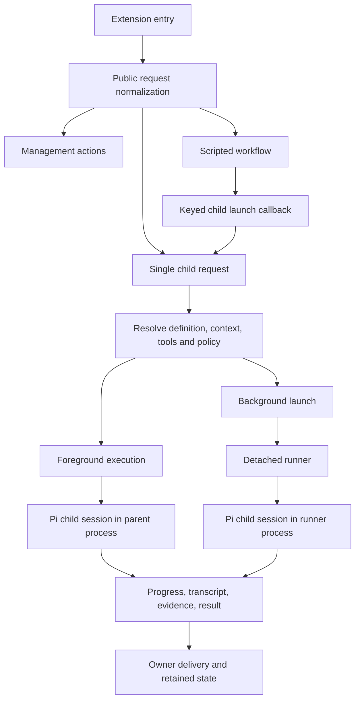

# Runtime walkthrough

Statements in this file describe the pinned upstream source. “Laser consequence” identifies replacement design work, not behavior already implemented.

## Entry points and execution paths

### Request admission

- [index.ts](upstream/index.ts) declines to register the parent extension when `PI_SUBAGENT_CHILD=1`. Explicitly authorized nested delegation uses a separate [fanout-child extension](upstream/src/extension/fanout-child.ts).
- [extension/index.ts](upstream/src/extension/index.ts), `registerSubagentExtension`, wires the tool, RPC, slash/prompt bridges, result delivery, waits, supervisor channel, watchdog and session events.
- [public-execution.ts](upstream/src/extension/public-execution.ts), `normalizePublicSubagentExecution`, defines the current public boundary. Direct `{agent, task}` and script/resource invocations are supported. Legacy `chain`, `tasks`, `parallel`, `chainDir`, top-level resume and caller-forged provenance are rejected.
- [subagent-executor.ts](upstream/src/runs/foreground/subagent-executor.ts), `createSubagentExecutor`, handles management and execution. It resolves cwd, definitions, context, model scope, nesting, launch capacity and execution policy. Internal compatibility branches are not automatically callable public capabilities.
- [top-level-async.ts](upstream/src/runs/background/top-level-async.ts) applies a configurable top-level async override; `foregroundOnly` bypasses it. **Laser consequence:** mandatory async child execution must be enforced by our own launch service on every route, not by copying this override.

### Definition resolution

[agents.ts](upstream/src/agents/agents.ts) parses markdown/frontmatter into `AgentConfig`, discovers builtin/package/user/project sources, resolves aliases and defaults, diagnoses invalid definitions, and merges sources. Source ranking includes runtime registrations above project, user, package and builtin entries. [runtime-agent-registry.ts](upstream/src/agents/runtime-agent-registry.ts) and [runtime-agent-events.ts](upstream/src/agents/runtime-agent-events.ts) add an in-process registration path; [agent-management.ts](upstream/src/agents/agent-management.ts) implements authoring operations.

Definitions cover more than prompts: models/fallbacks/thinking, tools/exclusions, nested delegation, skills, context inheritance, extension selection, MCP selectors, outputs, acceptance and memory. [profiles.ts](upstream/src/profiles/profiles.ts) also contains upstream opinionated roles. These are useful field examples, not Laser's identity taxonomy.

**Laser consequence:** use stable agent IDs and immutable definition revisions, with one resolver for root chat and child launches. Role belongs to the assignment. Use validated `.laser` configuration; do not copy `.pi` discovery, name-based role authority, ambient extensions or upstream profile storage as our schema.

### Resolve a launch before creating a session

[child-launch-plan.ts](upstream/src/runs/shared/child-launch-plan.ts) resolves step/default output, reads, skills, progress paths and multiple cwd meanings. It also namespaces inherited outputs in parallel groups. [child-tool-plan.ts](upstream/src/runs/shared/child-tool-plan.ts), `resolvePiLaunchToolPlan`, resolves requested/effective tools, extensions, direct MCP names and fanout authority; exclusions and ceilings narrow grants. Explicit empty arrays differ from omitted values. Required tools are checked again against runtime availability through [child-runtime-config.ts](upstream/src/runs/shared/child-runtime-config.ts) and [tool-availability.ts](upstream/src/runs/shared/tool-availability.ts).

[capability-ceiling.ts](upstream/src/runs/shared/capability-ceiling.ts) intersects exact-session registrations and inherited ceilings. Empty allowlists mean no access; undefined means no restriction from that source. It records restriction sources and removed tools. This is a useful enforcement/audit pattern, but an inherited allowed-agent list is not our whole per-hop access graph. A→B and B→C may be permitted while A→C remains forbidden; separate definition access from explicit task-wide restrictions.

[launch-contract.ts](upstream/src/shared/launch-contract.ts) has two distinct digests: definition projection and resolved launch binding. The latter includes task/prompt, tools, models, skills, output/schema and extension bindings. Preserve the distinction between “what was saved” and “what this attempt actually received.” A digest proves identity of a projection, not permission or correctness.

[api/preflight.ts](upstream/src/api/preflight.ts), `resolveSubagentLaunchContract`, returns a versioned inspected contract and diagnostics without launching a child. It resolves definition ambiguity, context, skills, models, ceilings and outputs. Some checks explicitly require live host/session snapshots, such as exact fork branching. Our UI preview should likewise distinguish resolved facts from checks still required at admission; a successful preview is not an everlasting launch permit.

### Pi session execution

[child-launch.ts](upstream/src/runs/shared/child-launch.ts) builds the typed launch; [child-hooks.ts](upstream/src/runs/shared/child-hooks.ts) installs session behavior. [child-session.ts](upstream/src/runs/shared/child-session.ts), `createDefaultChildSessionFactory`, wraps Pi `createAgentSession`, `SessionManager`, `DefaultResourceLoader` and a shared `ModelRuntime`. Its interface includes subscribe, prompt, steer, followUp, abort and dispose. File, directory, default and in-memory storage are distinct.

Important implementation hazards in this factory:

- Creation is serialized because extensions consume process-wide environment values during loading/startup. Serial creation is not complete isolation of later extension activity.
- It manipulates the resource loader's private `loaded` field to reset extension caching. Do not quietly transplant that workaround; use our worker isolation and documented Pi APIs, and test loaded extension/provider state.
- Shutdown emits extension lifecycle events, bounds their wait and disposes the session. Detached children outlive factory disposal and hold the shared runtime.
- The upstream factory reads engine settings/discovery conventions. Our adapter must continue disabling ambient project `.pi` configuration.

[execution.ts](upstream/src/runs/foreground/execution.ts), `runSingleAttempt` and `runSyncCompletionInner`, assemble effective prompts/tools, stream progress, track output and usage, handle model attempts, enforce deadlines, evaluate structured output/acceptance and persist results. [model-fallback.ts](upstream/src/runs/shared/model-fallback.ts) distinguishes explicitly chosen models from configured fallbacks and classifies failures. Do not assume retrying an attempt is safe after it modified files; the replacement needs retained evidence and a separately recorded attempt/recovery decision.

[context-mode.ts](upstream/src/runs/shared/context-mode.ts), [fork-context.ts](upstream/src/shared/fork-context.ts) and [pruned-fork.ts](upstream/src/shared/pruned-fork.ts) distinguish fresh from forked context and remove parent-only orchestration artifacts while retaining ordinary history. An implicit fork preference may fall back to fresh when no persisted leaf exists; an explicit fork request is strict. **Laser consequence:** expose requested/resolved context and the exact supplied source snapshot. Explicitly test removal of the active parent's goal authority; generic fork pruning is not proof of that requirement.

### Background runner and truthful settlement

[async-execution.ts](upstream/src/runs/background/async-execution.ts), `executeAsyncSingle`/`spawnRunner`, writes private launch configuration and initial state, starts a detached Node runner through Jiti, records process-instance identity, and uses startup/proceed barriers. Direct revival adds lease handshakes before execution can proceed. This ordering prevents an unowned writer from starting merely because process creation succeeded.

[subagent-runner.ts](upstream/src/runs/background/subagent-runner.ts) owns background orchestration, status/events, output capture, control requests, worktrees, acceptance and final artifacts. [run-child-session.ts](upstream/src/runs/background/run-child-session.ts) executes SDK sessions inside that runner. It tracks overlapping tools by call identity, abort settlement, compaction retries, final output drains and watchdog completion. A prompt promise, final assistant message, tool completion and process exit are different lifecycle signals.

[process-terminal.ts](upstream/src/runs/background/process-terminal.ts), [owned-process-tree.ts](upstream/src/runs/background/owned-process-tree.ts), [stale-run-reconciler.ts](upstream/src/runs/background/stale-run-reconciler.ts) and [session-lease.ts](upstream/src/runs/shared/session-lease.ts) guard cleanup and ownership. The lease canonicalizes the session path, records token/host/PID/process-start identity and writer state, and refuses ambiguous stale ownership. A live PID or old timestamp alone cannot establish the relevant writer's identity.

**Laser consequence:** one worker per execution directory, one writer per session, one neutral lifecycle contract. An open child conversation sends commands to its existing owner; it must not open a second writing session. Use adapters around the existing driver seam rather than a separate child-only model loop.

## Persistence and delivery map

| Upstream artifact or subsystem | Meaning and source | Replacement lesson |
| --- | --- | --- |
| `status.json`, event JSONL, output logs | [async-status](upstream/src/runs/background/async-status.ts), [runner](upstream/src/runs/background/subagent-runner.ts) | Separate durable truth, bounded live projection and full retained transcript |
| Child session file + transcript projection | [child-transcript](upstream/src/shared/child-transcript.ts), [result-files](upstream/src/runs/background/result-files.ts) | Preserve session identity and original tool/message IDs; summaries cannot replace conversations |
| Active/terminal run indexes | [active-run-index](upstream/src/runs/background/active-run-index.ts), [terminal-run-index](upstream/src/runs/background/terminal-run-index.ts) | Discovery, liveness and resumability are different facts |
| Completion files/indexes | [result-watcher](upstream/src/runs/background/result-watcher.ts), [completion-replay](upstream/src/runs/background/completion-replay.ts) | Recover delivery after reconnect; do not infer “delivered” from file existence |
| Owner identity and duplicate suppression | [result-delivery-ownership](upstream/src/runs/background/result-delivery-ownership.ts), [completion-dedupe](upstream/src/runs/background/completion-dedupe.ts), [completion-owner](upstream/src/shared/completion-owner.ts) | Route to exact session/owner, not repository or display name; durable idempotent effects |
| Retained/recovery records | [retained-children](upstream/src/runs/background/retained-children.ts), [async-resume](upstream/src/runs/background/async-resume.ts) | Same logical assignment may have multiple attempts; resumption needs validated lineage and writer ownership |
| Retention decisions | [async-retention](upstream/src/runs/background/async-retention.ts) | Preserve unknown state, resumable sessions and linked evidence; dismissal is not destruction |
| Nested routes and state | [nested-events](upstream/src/runs/shared/nested-events.ts), [retained-nested-route-tracker](upstream/src/runs/background/retained-nested-route-tracker.ts) | Root routing identity, ancestor path, event identity and capability token; validate containment/metadata |
| Wait subscriptions | [subagent-wait](upstream/src/runs/background/subagent-wait.ts), [wait-subscriptions](upstream/src/runs/background/wait-subscriptions.ts) | Completion-before-subscribe must work; wait timeout must not stop the child |

## Remaining source areas and scope disposition

| Area | What to learn | Do not turn it into a required Laser feature |
| --- | --- | --- |
| `missions/` | Durable record updates, linked runs and file locking | Separate mission goal loop/budget or mandatory mission entity |
| `watchdog/` | Change signatures, bounded review input, epochs, stale-result rejection, warning/permission evidence, LSP diagnostics | Mandatory named watchdog agent or invisible automatic launch outside policy |
| `runs/shared/external-*`, CLI adapters | Honest capability matrices and external job lifecycle | Automatic switch to an external CLI when Pi delegation fails |
| `runs/background/scheduled-runs.ts` | Persisted schedule ownership, cancellation and result routing | New scheduling product scope merely because upstream has it |
| `slash/`, `prompts/`, `skills/` | Intent examples and composition recipes | Terminal commands or framework modes users must learn |
| `tui/`, `inspectors/`, `integrations/` | Status projection, hierarchy, drill-down and liveness | TUI components, Herdr/Orca integrations or upstream renderers in our UI |
| `agents/agent-memory.ts`, refinements, profiles | Revision/provenance concerns and reusable context | Hidden changes to an agent's definition or hard-coded role privileges |
| `shared/` filesystem/JSON helpers | Atomic writes, bounded parsing, retry/capacity behavior and canonical paths | A blanket “ignore every storage error” policy |

All modules, including these secondary areas, are in the [source index](source-map.md). The focused walkthrough follows critical execution bodies; the index is structural coverage, not a claim that every line of every terminal/integration module received a security audit.
