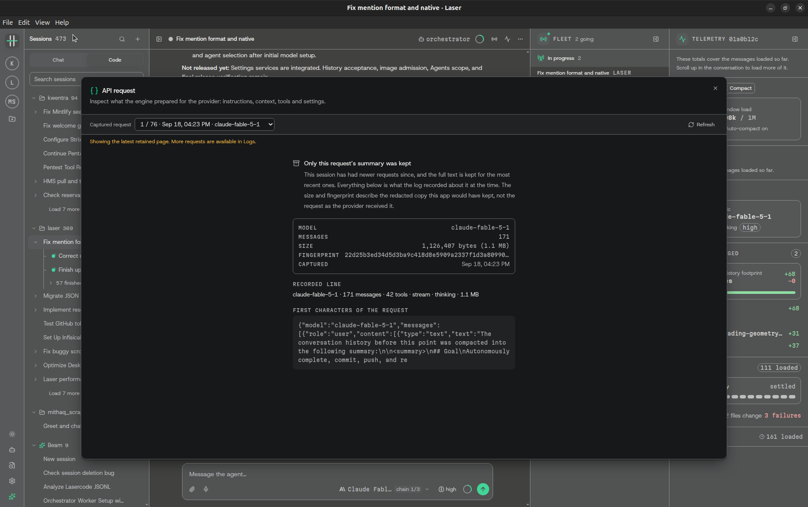

- migrate json based agents definition to mdx based (learn it from claude code)
- add core mandatory laser prompt included unless the used checked the "Exclude Laser's Core Instructions Prompt" (unchecked by default) checkbox inside this specific laser agent settings
- https://github.com/ayghri/i-have-adhd
- spec-kit with visuals (NO)
- agent give names to the subagents, and commands (almost all the tools, should have field attached to the tool params to describe what it is doing that is not exceeding 25 char), leaving the namer agent to only same new sessions
- goals got paused in the middle of the night
- monorepo, single repo, dir of repos like kwentra (in terms of worktrees, and relative file mentions from the agent)
- bug in the @ file selector it don't select folders!
- load more is flaky and sometimes need more than one click to load! it should add in between brackets the number of sessions it will be loaded
- 
- auto-follow (scroll down when new agent message come all together)
- https://github.com/alphaXiv/OpenResearch
- https://github.com/gastownhall/beads
- : user should have the choice! he navigate in the settings and the resources page give him the info about the size f the logs, and he have full dynamic

=======================================

## Steps to improve my coding harness

- Agents
  - move the md files to the ~/.laser
- Core Instructions

as u can see the user have alot of problems here with this view!

- the user cannot read either the project name nor the branch/worktree! those should stack in two rows
- 